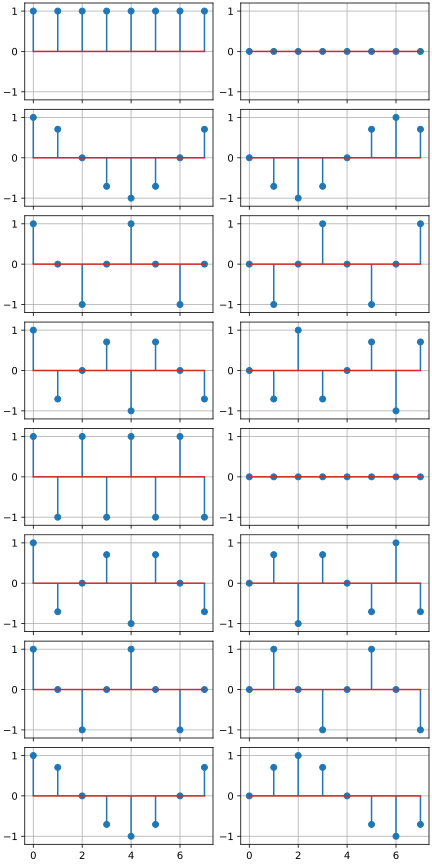
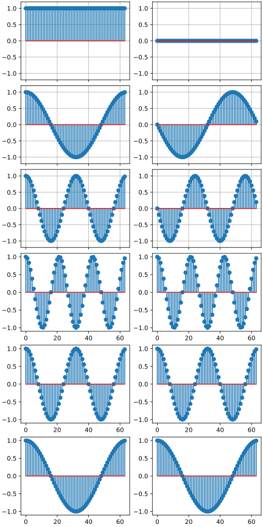
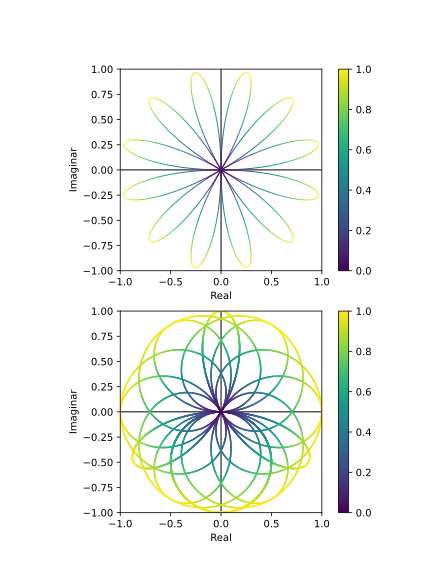
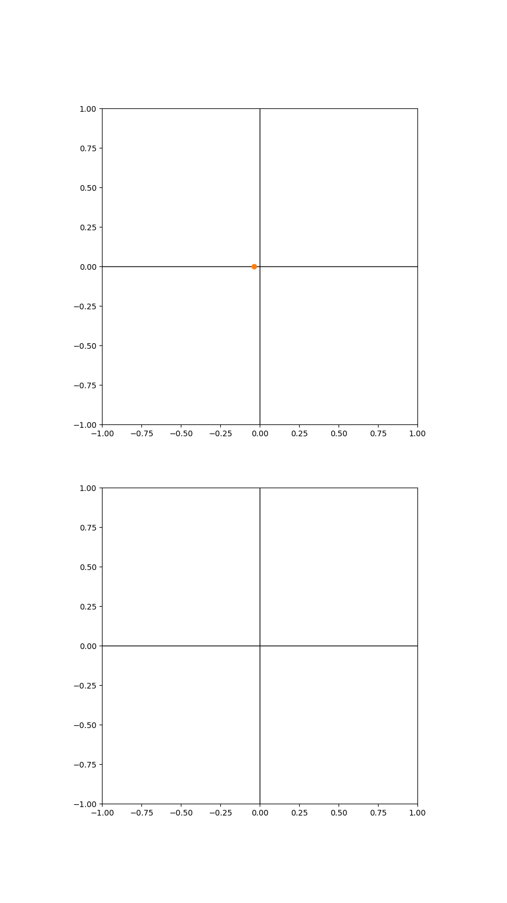
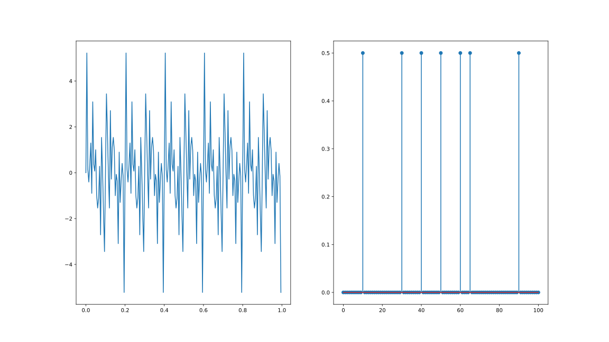

# Ex 1

To see the sinusoidal patterns clearer, we can plot for `N = 64`, showing the first 3 terms (and the symmetric last 3 terms).

# Ex 2

Line color represents distance to origin

Animation of the drawing:

# Ex 3

