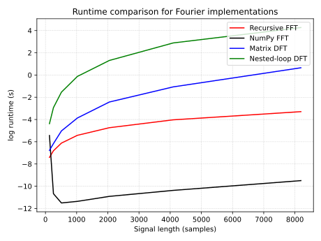
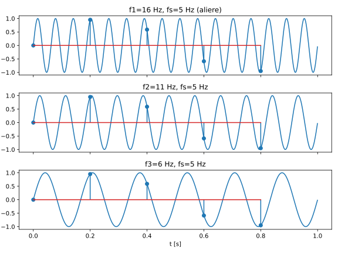
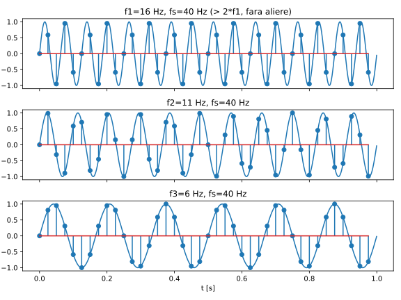
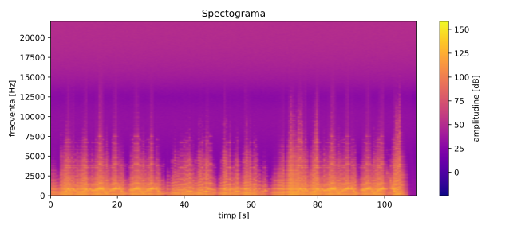

# Ex 1

# Ex2

# Ex3

# Ex4

Pentru a putea eșantiona în siguranță frecvențe în intervalul $f \in [44 \;\mathrm{Hz}, 200 \;\mathrm{Hz}]$, frecvența de eșantionare minimă este frecvența Nyquist.

$$
f_s \geq 2 \cdot f_{max} = 2 \cdot 200 \; \mathrm{Hz}
$$

Deci

$$
f_{min} = 400 \; \mathrm{Hz}
$$

# Ex5
Spectogram of a Chopin Waltz:

# Ex6

$$
\begin{aligned}
\mathrm{SNR_{dB}}  &= 10 \log \mathrm{SNR} = \\
&= 10 \log \frac{P_{semnal}}{P_{zgomot}}90
\end{aligned}
$$
Deci, in dB
$$
\mathrm{SNR_{dB}} = P_{semnal,dB} - P_{zgomot,dB} \implies P_{zgomot,dB} = 90 - 80 \; \mathrm{dB} = 10 \; \mathrm{dB}
$$