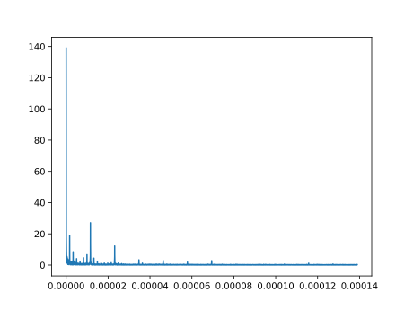
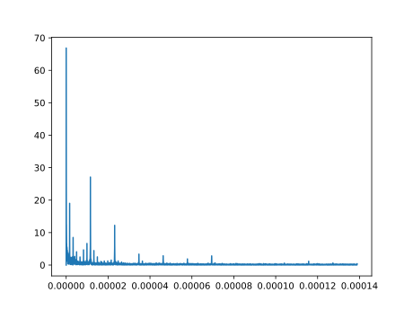
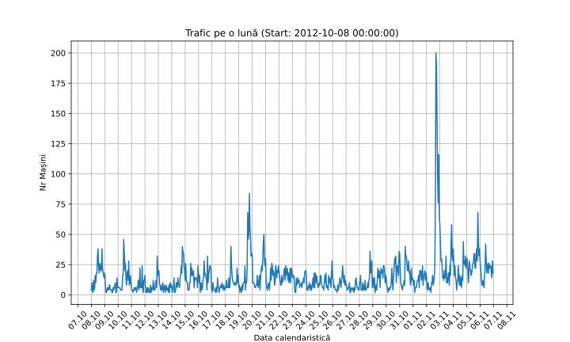
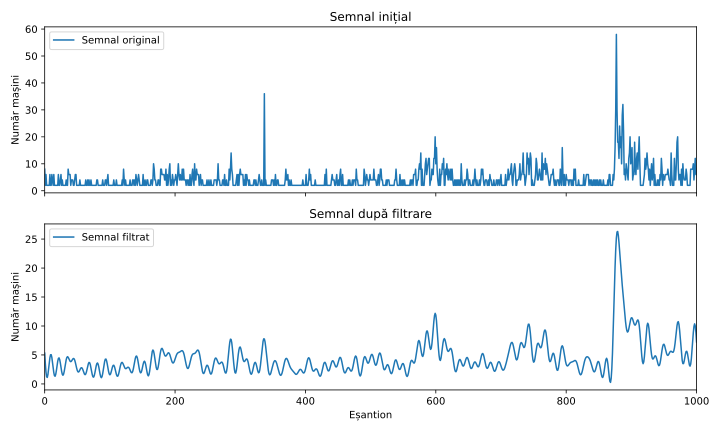

# Lab 5
Processing the data [found here](https://www.kaggle.com/datasets/lampubhutia/bullettrain-timeseries-data?select=Train.csv).

## (a)
Frecvența de eșantionare

$$
f_s = \frac{1}{1 \; h} = \frac{1}{3600 \; s} = 2.(7) \cdot 10^{-4} \; \mathrm{Hz}
$$

## (b)

Intervalul de timp

$$
T = 18 288 \cdot 1\;h = 762 \text{ zile} = 2.087 \text{ ani}
$$

## (c)

Frecvența maximă este frecvența Nyquist

$$
f_{max} = \frac{f_s}{2} = 1.3(8) \cdot 10^{-4} \; \mathrm{Hz}
$$

## (d)



## (e)



## (f)

Rezultatele sunt

```
Main frequencies:
        - f1 = 1.518907358802372e-08 Hz, T = 18288.0 h
        - f2 = 3.037814717604744e-08 Hz, T = 9144.0 h
        - f3 = 4.5567220764071157e-08 Hz, T = 6096.0 h
        - f4 = 1.1574074074074075e-05 Hz, T = 23.999999999999996 h
```

Celelalte frecvențe sunt multiplii ai frecvenței fundamentale (frecvența minimă)

$$
\Delta f = \frac{f_s}{N} \approx 1.518 \cdot 10^{-8} \; \mathrm{Hz}
$$

Anume
$$
\begin{aligned}
&f_1 = \Delta f\\
&f_2 = 2 \cdot \Delta f\\
&f_3 = 3 \cdot \Delta f
\end{aligned}
$$

Aceste frecvențe sunt cele mai apropiate de 0 și indică o tendință (schimbare neperiodică, înceată). În aceste date, aceasta este tendința creșterii numărului de mașini.

## (g)



## (h)

- *Pasul 1*: aflăm zilele săptămânânii. Weekend-urile reprezintă două zile în care intensitatea traficului este scăzută, astfel încât putem căuta perioade de 5 zile de intensitate crescută și 2 de intensitate scăzută pentru a determina weekend-urile.

- *Pasul 2*: căutăm anomalii. Parcurgem calendarul și încercăm să găsim perioadele în care avem intensități scăzute, dar care nu corespund weekend-urilor. Acestea vor corespunde, cel mai probabil, sărbătorilor. Acestea sunt deja cunoscute și poate fi precalculată o distribuție/mască a perioadelor libere și a weekend-urilor.

- *Pasul 3*: comparăm distribuția weekend/sărbători calculată de noi cu această mască, pentru a determina anul.

>[!warning] *Surse de erori*
>
> - Sărbătorile pot să ducă la un calcul greșit al weekend-urilor (dacă avem două sărbători, între care se află weekend-ul, atunci fereastra de plasare a weekend-ului este mult mai mare și ridică riscul erorii).
> - Nu toate sărbătorile marchează o scădere în intensitatea mașinilor - dacă orașul este turistic (e.g., are multe târguri de Crăciun), intensitatea mașinilor nu va scădea, ca într-un weekend.

## (i)

