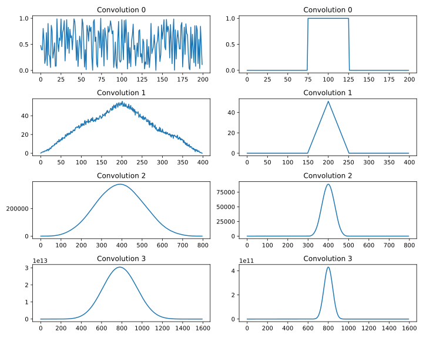
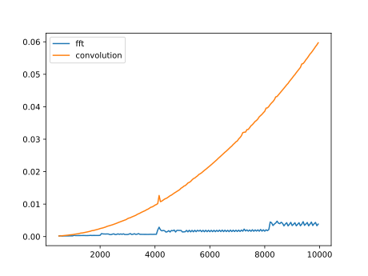
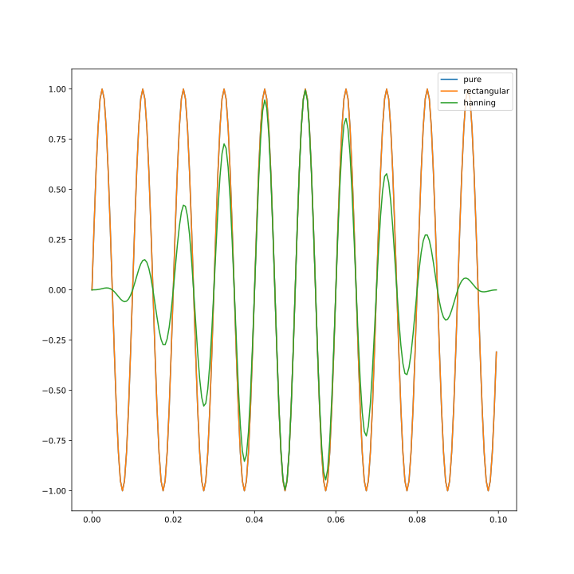
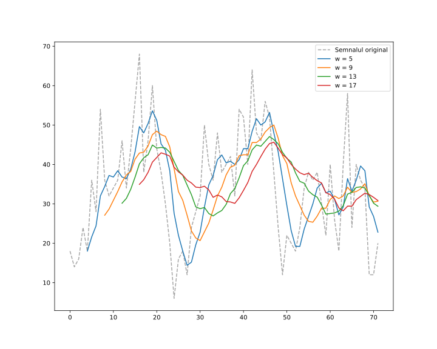
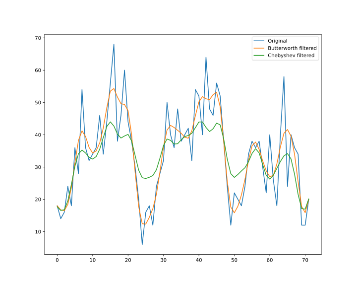
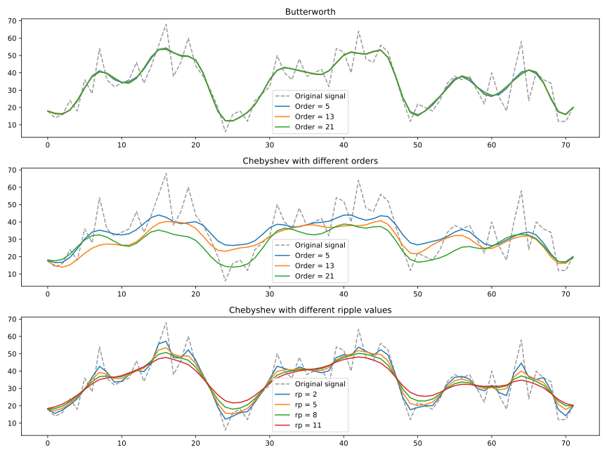

# Lab 6

## (1)

## (2)

## (3)

The duration of multiplying two random polynomials with maximum degree of $N$. One is implemented using `np.convolve()` and the other using `np.fft.fft()` in $O(n \log n)$.

## (5)

## (6)

The sampling frequency $f_s$ is:

$$
f_s = \frac{1}{3600 \; \mathrm{s}} = 2.(77) \cdot 10^{-4}
$$

The Nyquist frequency is:

$$
f_N = \frac{f_s}{2} = 1.3(8) \cdot 10^{-4}
$$

We want to eliminate very frequent events (those that happen every 5 hours, at max).

Therefore, we have

$$
f_w = \frac{1}{3 * 3600} = \frac{f_s}{5} = 5.(5) \cdot 10^{-5} \; \mathrm{Hz}
$$

Relative to $f_N$

$$
\frac{f_w}{f_N} = \frac{\frac{1}{5}}{\frac{1}{2}} = \frac{2}{5} \implies f_w = \frac{2}{5} \cdot f_N
$$

Filtering with this frequency:

