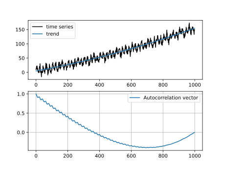
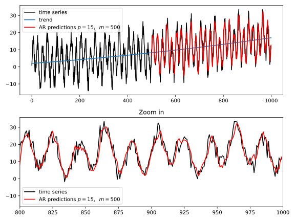
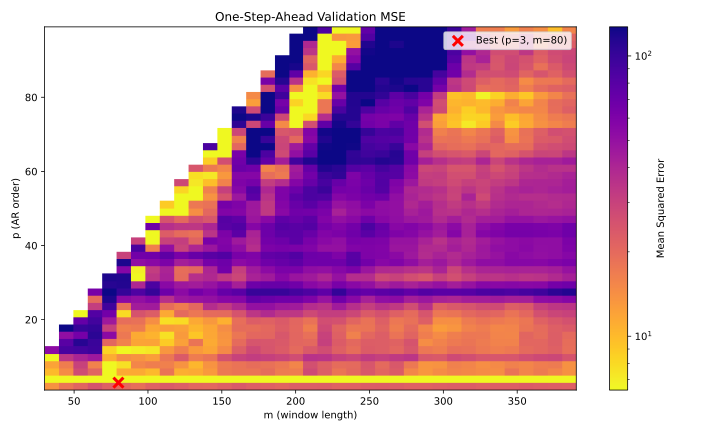

# Lab 8

## (a) and (b)

We simulate a time series and calculate the autocorellation vector on itself:

## (c)

We build an autoregressive model on the time series with $p$ being the number of parameters used and $m$ the time window.

## (d)

Hyperparameter tuning on $(p, m)$. We show the heatmap of the errors, where, the brighter the color, the smaller the error:

